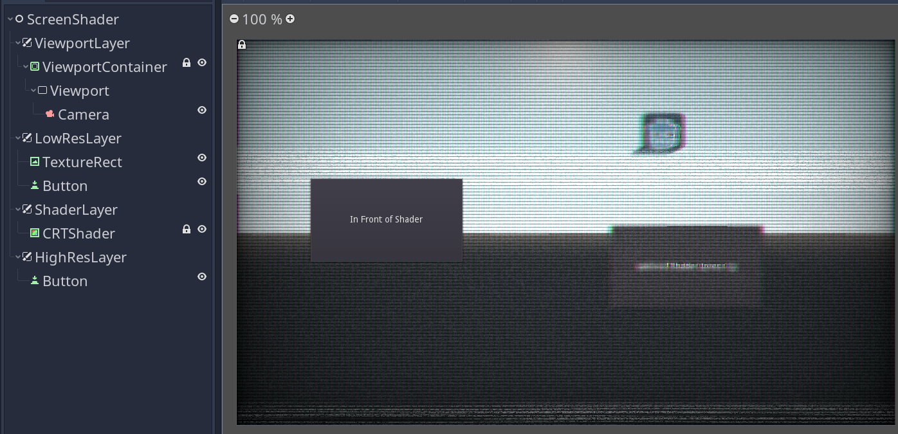
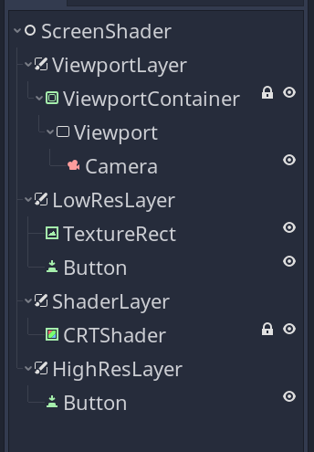

Add scenetree walkthrough and screenshots to README

# Button-Shader-Sandwich
A Godot demo that lets you click buttons on either side of a shader.

# Stepping through the scene tree

- Node
  - ViewportLayer
    - ViewportContainer
      - Viewport
        - Camera
  - LowResLayer
    - TextureRect
    - Button
  - ShaderLayer
    - CRTLayer
  - HighResLayer
    - Button

## Node

A base node is here to let each CanvasLayer stand on its own. This scene could be autoloaded or regularly instanced (save for the Viewport/Camera setup) to automatically apply the same UI and shader to all scenes.

### ViewportLayer

An optional CanvasLayer that holds a ViewportContainer. This is only if you actually need a Viewport node in your scene, or if you're planning to stack Viewports together for other effects like a minimap or a second camera that only renders distant scenery in a different world / culling mask, and uses a different z-clip mask.

#### ViewportContainer, Viewport, and Camera

ViewportContainer Has stretch enabled. Viewport has size set to about 600 x 400. Camera is current.

You can put your Player character here if it has a current Camera. You can also remove this entire branch and pretend like things are normal, delegating this scene to UI only.

### LowResLayer

Text, buttons, TextureRects, and other Control nodes that are behind the CRT shader, appearing low-res.

### TextureRect and Button

The Button can be pressed even though it's behind the shader, because the ColorRects of the shaders have Mouse -> Filter -> Ignore set.

A shortcut is enabled on this button for the InputEvent action "q", activated by pressing <kbd>Q</kbd> on your keyboard.

The TextureRect is meant to show that you can place textures here to post-process them.

### ShaderLayer

ShaderLayer holds ColorRects that have shaders in their material slot.

#### CRTLayer

CRTLayer is a ColorRect with Mouse -> Filter -> Ignore set. **This mouse filter setting is important to allow buttons under the shader to react.**

This shader is from https://godotshaders.com/shader/vhs-and-crt-monitor-effect/ licenced under CC0. I enabled "overlay" and set the warp amount to 0.0 so the buttons under the shader weren't visually warped away from their actual button mask.

### HighResLayer

HighResLayer holds Control nodes that need to appear higher-res and not under the shader's influence. This is intended for readible text or clear buttons.

#### Button

Higher res button that is also able to take player input.
